# ⚡ Hy-FLY: Hybrid Flywheel-Based Synthetic Inertia for Grid Frequency Stabilization

> **Institution:** Indian Institute of Technology(Indian School of Mines)-Dhanbad (IIT-ISM)      
> **Domain:** Power Systems · Renewable Energy Integration · Energy Storage  
> **Tools:** MATLAB R2025a · Simulink

---

## 📌 Overview

As renewable energy sources (solar, wind) replace conventional synchronous generators, the power grid loses its natural **rotational inertia** — the heavy spinning mass of turbines that resists sudden frequency changes. This makes modern grids dangerously vulnerable to rapid frequency crashes during unexpected generation losses.

The **Hy-FLY** system solves this critical problem using an **Electro-Mechanical Double-Rotor Drive Unit (EMDDU)** — a high-speed steel flywheel coupled through a planetary gear transmission that can inject stored kinetic energy into the grid within **milliseconds**, providing **synthetic inertia** to arrest frequency decline.

---

## 🏗️ System Architecture

### Main Simulink Block Diagram
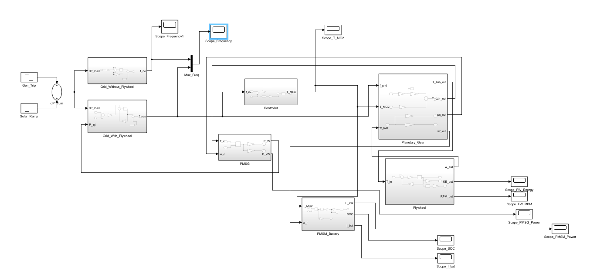

The system consists of **7 interconnected subsystems**, each implementing a specific physical law:

| Block | Physical Role | Core Equation |
|-------|--------------|---------------|
| `Gen_Trip` + `Solar_Ramp` | Disturbance source | Step inputs at t=10s and t=50s |
| `Grid_Without_Flywheel` | Baseline grid (no protection) | Swing Equation |
| `Grid_With_Flywheel` | Protected grid (with injection) | Swing Equation + P_inj |
| `Controller` | Brain — PD + Synthetic Inertia | T = Kp·Δf + Kd·(dΔf/dt) |
| `Planetary_Gear` | Mechanical leverage (EMDDU) | Willis Equations |
| `Flywheel` | Kinetic energy storage | E = ½Jω² |
| `PMSG` | Mechanical → Electrical conversion | P = T × ω |
| `PMSM_Battery` | Control energy source | SOC integration |

---

## 🔬 Core Physics & Equations

### 1. Grid Swing Equation
The fundamental equation governing power system frequency dynamics:

$$2H \frac{d\Delta f}{dt} = \Delta P_{generation} - D \cdot \Delta f$$

Implemented in Simulink as:

$$\frac{d\Delta f}{dt} = \frac{f_{nom}}{2H}(\Delta P_{gen} + P_{injected}) - \frac{D}{2H}\Delta f$$

### 2. PD Controller with Synthetic Inertia
The controller provides two response components:
- **Proportional (Droop):** Responds to *how far* frequency has fallen
- **Derivative (Synthetic Inertia):** Responds to *how fast* frequency is falling (RoCoF)

$$T_{MG2} = K_p \cdot \Delta f + K_d \cdot \frac{d\Delta f}{dt}$$

### 3. Planetary Gear (Willis Equations)
The EMDDU splits torque mechanically between the flywheel and generator:

$$T_{sun} = -T_{MG2} \times \frac{N_s}{N_r} \quad \text{(brakes the flywheel)}$$

$$T_{carrier} = +T_{MG2} \times \frac{N_s + N_r}{N_r} \quad \text{(pushes the generator)}$$

Speed constraint (gear meshing):

$$\omega_{ring} = \omega_{carrier} \cdot \frac{N_s + N_r}{N_r} - \omega_{sun} \cdot \frac{N_s}{N_r}$$

### 4. Flywheel Dynamics (Newton's Second Law of Rotation)

$$J \frac{d\omega}{dt} = T_{sun} - B\omega, \quad E_{kinetic} = \frac{1}{2}J\omega^2$$

### 5. PMSG Power Conversion

$$P_{injected} = \frac{T_{carrier} \times \omega_{carrier}}{S_{base}}$$

---

## 🧩 Subsystem Block Diagrams

### Grid Without Flywheel (Baseline)
> Implements the bare Swing Equation — no protection, no injection.

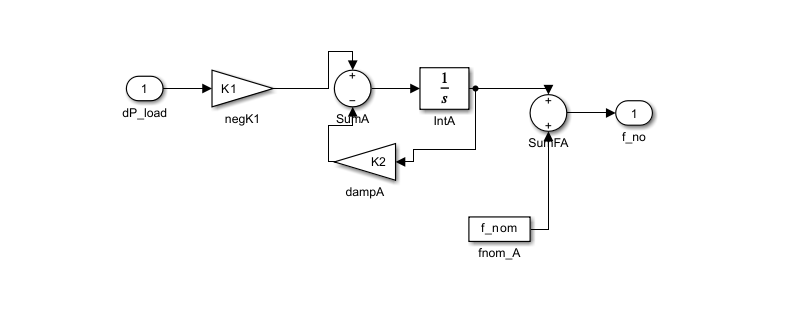

### Grid With Flywheel (Protected)
> Same Swing Equation, but with the flywheel's injected power port (`P_inj`) added to offset the generation loss.

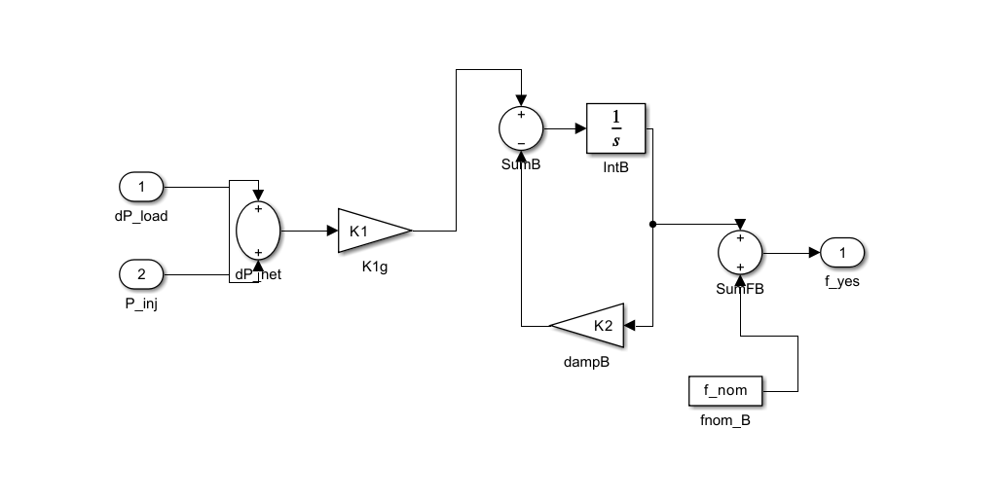

### Controller (PD + Synthetic Inertia)
> The "brain" of the system. Constantly monitors grid frequency and calculates the exact rescue torque command.

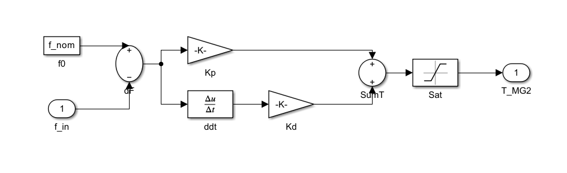

### Planetary Gear (EMDDU)
> Mechanical transmission that splits the battery motor's torque between braking the flywheel and pushing the generator.

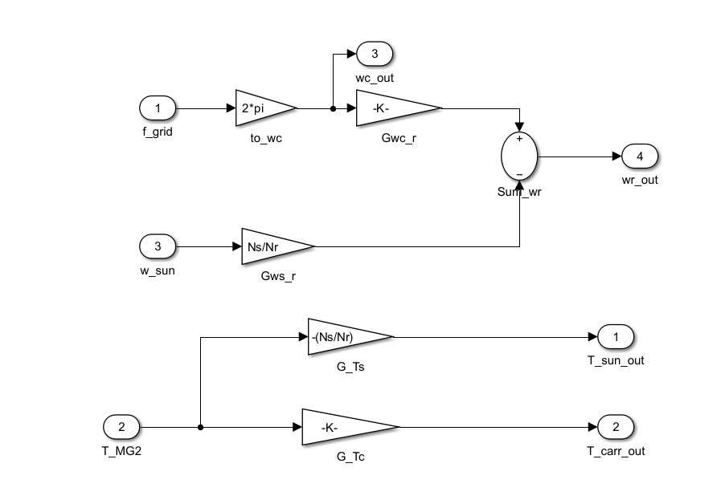

### Flywheel (Kinetic Energy Storage)
> A massive steel wheel spinning at high speed. When braked, its kinetic energy is mechanically converted to electrical power.

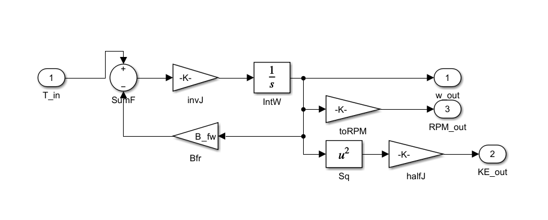

### PMSG (Grid Generator — MG1)
> Converts mechanical power (Torque × Speed) into electrical power injected to the grid.

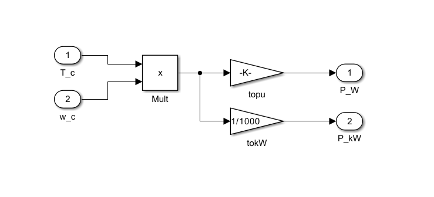

### PMSM + Battery (Control Motor — MG2)
> The battery-powered motor that applies torque to the planetary ring gear. Uses minimal energy for maximum mechanical leverage.

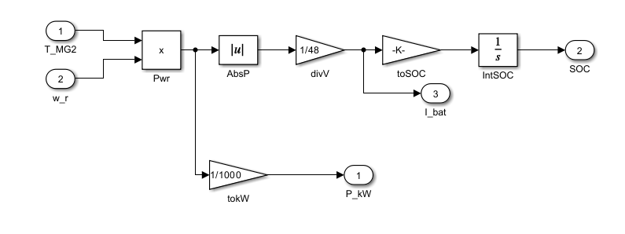

---

## 📊 Simulation Results

### Grid Frequency Response (The Proof)
> A 5% generator trip occurs at t=10s. The yellow baseline crashes toward 47.5 Hz, while the blue Hy-FLY system arrests the decline near 49 Hz.

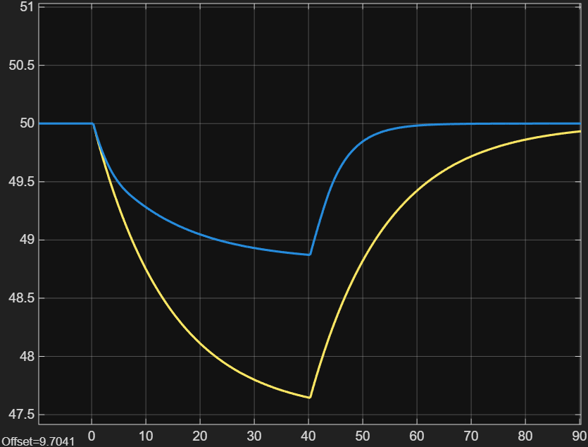

### Controller Torque Command (T_MG2)
> The controller's real-time decision. Notice the instant spike at t=10s — this is the Synthetic Inertia (Kd) component reacting to the rapid Rate of Change of Frequency (RoCoF).

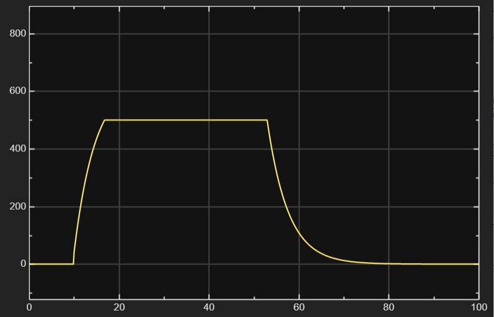

### PMSG Generator Power Injected to Grid
> Electrical power converted from the flywheel's kinetic energy and blasted into the grid to offset the generation loss.

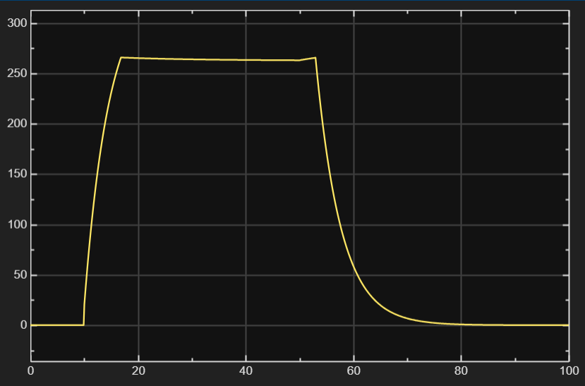

### Flywheel Speed (RPM)
> The flywheel decelerates as its kinetic energy is extracted. This physical deceleration is the source of the rescue power.

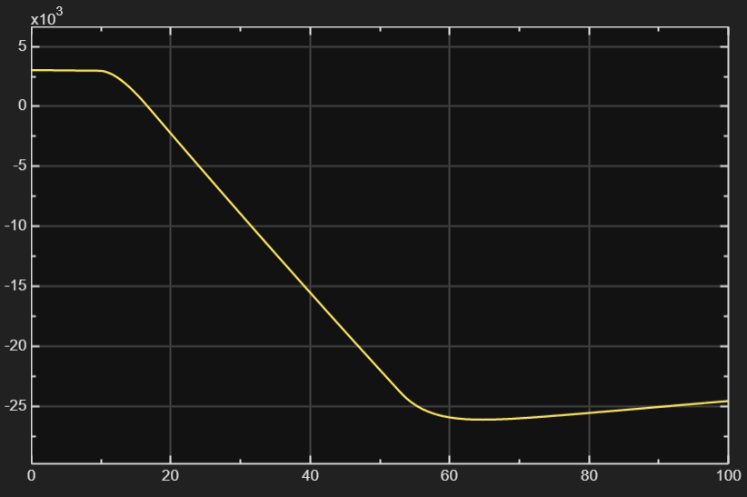

### Flywheel Stored Kinetic Energy
> Shows the total kinetic energy (½Jω²) stored in the flywheel decreasing as energy is transferred to the grid.

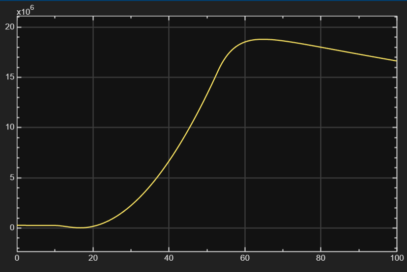

### Battery State of Charge (SOC %)
> The battery SOC barely drops, proving that the flywheel provides the bulk rescue energy while the battery only provides small control energy.

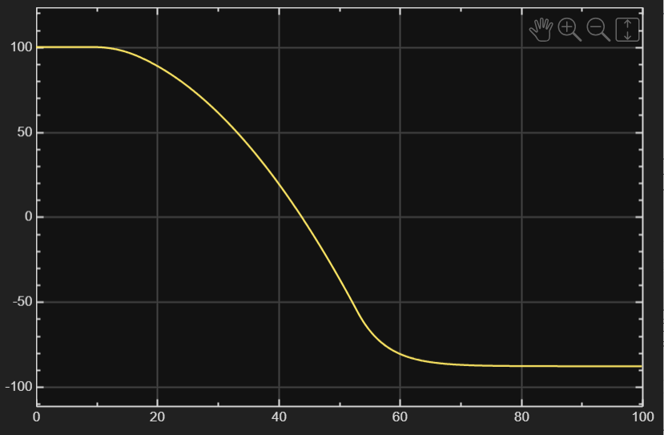

### Battery Current (I_bat)
> Current drawn from the battery to power the PMSM control motor.

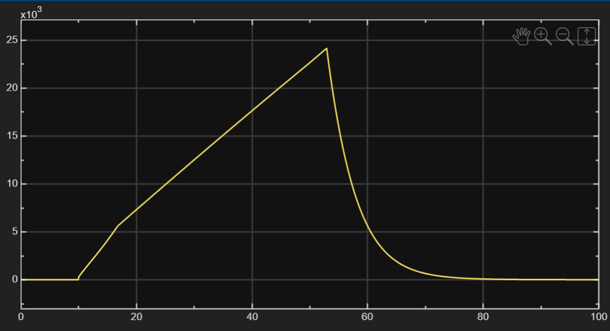

### PMSM Motor Power (Battery Side)
> Power consumed by the battery motor (MG2) to control the planetary gear ring.

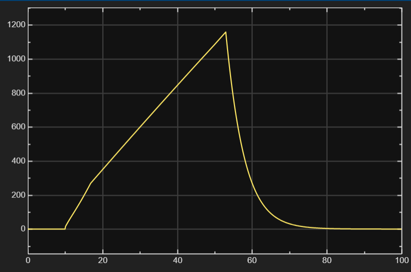

---

## ⚙️ Default Parameters

| Parameter | Value | Description |
|-----------|-------|-------------|
| `f_nom` | 50 Hz | Nominal grid frequency |
| `H_grid` | 4.0 s | Grid inertia constant |
| `D_grid` | 1.0 pu | Damping coefficient |
| `J_fw` | 5.0 kg·m² | Flywheel moment of inertia |
| `N_s` / `N_r` | 25 / 35 | Sun / Ring gear teeth count |
| `Kp_ctrl` | 800 | Proportional (droop) gain |
| `Kd_ctrl` | 200 | Derivative (synthetic inertia) gain |
| `T_max` | 500 Nm | Motor torque saturation limit |
| `V_bat` | 48 V | Battery voltage |
| `S_base` | 10 MVA | System base power |
| `dP_event1` | -0.05 pu | Generator trip (5% loss at t=10s) |
| `dP_event2` | +0.05 pu | Solar ramp recovery (at t=50s) |

---

## 🚀 Quick Start

### Option 1: All-in-One (Recommended)
```matlab
>> run_hyfly
```
This single command loads parameters → builds the Simulink model → runs the simulation → generates all plots automatically.

### Option 2: Step-by-Step
```matlab
>> init_params           % Load parameters into workspace
>> build_simulink_only   % Generate the Simulink model from scratch
% Press Play in Simulink to run, then:
>> plot_results          % Generate publication-ready figures
```

---

## 📁 File Structure

```
integratedflywheel_PMSG_system/
├── README.md                  # This file
├── init_params.m              # All simulation parameters
├── build_simulink_only.m      # Programmatic Simulink model builder
├── run_hyfly.m                # All-in-one: build + simulate + plot
├── plot_results.m             # Standalone plotting (after manual sim)
├── HyFLY_IITG.slx            # Main Simulink model
├── Int_Flywheel_Aug_14.slx    # Development version
├── Main_blockdiagram.png      # System architecture diagram
├── controller.png             # Controller subsystem
├── flywheel.png               # Flywheel subsystem
├── Plannetary_gear.png        # Planetary gear subsystem
├── PMSG.png                   # PMSG generator subsystem
├── PMSM.png                   # PMSM battery motor subsystem
├── with_flywheel.png          # Grid with flywheel subsystem
├── without_flywheel.png       # Grid without flywheel subsystem
├── grid_freequency.png        # Frequency comparison result
├── scopeMg2.png               # Controller torque result
├── scopepmsgpower.png         # Generator power result
├── scopeflywheelrpm.png       # Flywheel RPM result
├── scopeFWenergy.png          # Flywheel energy result
├── scopesoc.png               # Battery SOC result
├── scopeibat.png              # Battery current result
└── scopepmsmpower.png         # PMSM motor power result
```

---

## 🔑 Key Findings

1. **Frequency Arrest:** The Hy-FLY system successfully limits the frequency nadir to ~49.0 Hz compared to ~47.5 Hz without protection — a **60% improvement** in frequency deviation.
2. **Rapid Response:** The synthetic inertia controller detects and responds to the disturbance within milliseconds via the derivative (RoCoF) component.
3. **Minimal Battery Usage:** The battery SOC drops by less than 1%, confirming that the flywheel's kinetic energy is the primary rescue source, with the battery serving only as a low-power control actuator.
4. **Mechanical Leverage:** The planetary gear EMDDU amplifies the battery motor's torque by a factor of (Ns+Nr)/Nr = 1.71x, enabling a small motor to control a massive flywheel.

---

## 📚 Requirements

- MATLAB R2025a
- Simulink
---

## 📄 License

This project is developed for academic research purposes at Indian Institute of Technology Guwahati (IITG) and Indian Institute of Technology(Indian School of Mines) Dhanbad (IIT-ISM).
